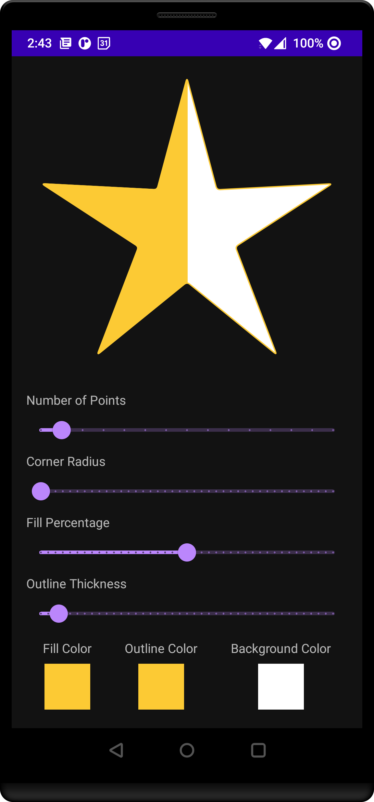
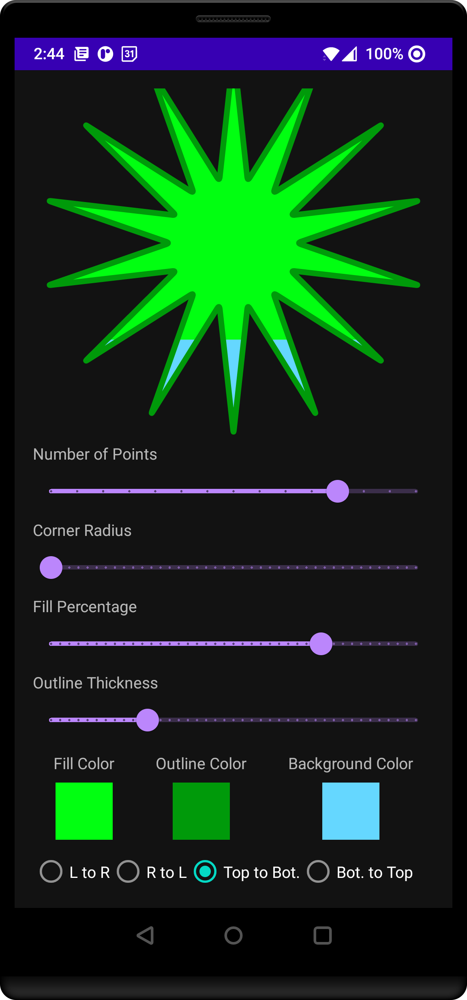

<h1 align="center"> StarView </h1>

<p align="center">
:star2: Simple custom view that draws an n-point star for Android.
</p>

<p align="center">
    <a href="https://github.com/DeveloperPaul123/StarView/stargazers"></a>
    <a href="https://img.shields.io/discord/652515194572111872"></a><br>
</p>

<p align="center">
    
    
</p>

## Features

* Draw any n-point star
* Configurable colors
  * Supports background color, outline color and fill color
* Supports curved corners with controllable corner radius
* Control fill amount and direction

## Include in your project

### Gradle

Add the following to your root `build.gradle` if not there already.

```gradle
allprojects {
    repositories {
        mavenCentral()
    }
}
```

Then add the dependency to your **module's** `build.gradle` file:

```gradle
dependencies {
    implementation "io.github.developerpaul123:star-view:<version>"
}
```

## Usage

Add the `StarView` to your layout `xml`:

```xml
<com.developerpaul123.starview.StarView
            android:id="@+id/starView"
            android:layout_width="match_parent"
            android:layout_height="match_parent"
            android:minHeight="350dp"
            app:fillPercentage="0.5"
            app:outlineThickness="4.0" />
```

Other available attributes:

| Attribute | Value Type(s) | Description |
|:---------:|:-------------:|:------------|
|`fillDirection`|`StarView.FillDirection`|Control what direction the star is filled from.|
|`fillPercentage`| `float`, clamped to `0.0` -> `1.0` | Control the fill percentage. |
|`numberOfPoints`| `int`, minimum of 3 | Control the number of points in the star. |
|`outlineThickness` | `float` | Control the outline thickness. |
|`starColor` | `Color` | The fill color of the star. |
|`starOutlineColor` | `Color` | The outline color of the star. |
|`starBackgroundColor` | `Color` | The background color of the star. Only visible when not filled. |
|`starCornerRadius` | `float` | The corner radius for the points of the star. |

All of the above attributes can be controlled via `XML` and `Kotlin`.

## Contributing

Contributions are very welcome. Please see [contribution guidelines for more info](CONTRIBUTING.md).

## License

The project is licensed under the MIT license. See [LICENSE](LICENSE) for more details.

## Author

| [<br><sub>@DeveloperPaul123</sub>](https://github.com/DeveloperPaul123) |
| :-------------------------------------------------------------------------------------------------------------------------------------------------------: |
